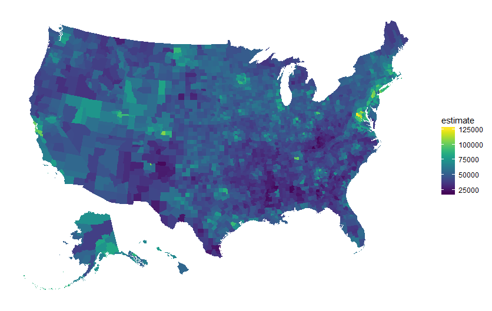

## tidycensus

[](https://travis-ci.org/walkerke/tidycensus)   

__tidycensus__ is an R package that allows users to interface with the US Census Bureau's decennial Census and five-year American Community APIs and return tidyverse-ready data frames, optionally with simple feature geometry included.  Install from CRAN with the following command: 

```r
install.packages("tidycensus")
```

## In version 0.4.6: 

* Bug fixed that was causing GEOIDs for some states to be converted to NA on certain Linux platforms

* A new parameter, `shift_geo`, allows tidycensus users to get US state and county geometry originally obtained with the __albersusa__ R package with Alaska and Hawaii shifted and re-scaled for better cartographic display of the entire US.  

```r
# Requires the installation of the GitHub version and ggplot2
# library(devtools)
# install_github("tidyverse/ggplot2")

library(tidycensus)
library(tidyverse)
library(viridis)

us_county_income <- get_acs(geography = "county", variables = "B19013_001", 
                            shift_geo = TRUE, geometry = TRUE)

ggplot(us_county_income) + 
  geom_sf(aes(fill = estimate), color = NA) + 
  coord_sf(datum = NA) + 
  theme_minimal() + 
  scale_fill_viridis()

```



## In version 0.4: 

* tidycensus now defaults to the new 2012-2016 five-year ACS estimates in `get_acs()`. 

* By passing a named vector to the `variables` parameter in `get_acs()` or `get_decennial()`, tidycensus will let you define your own variable names rather than the Census ID codes.  For example: 

```r
racevars <- c(White = "P0050003", 
              Black = "P0050004", 
              Asian = "P0050006", 
              Hispanic = "P0040003")

harris <- get_decennial(geography = "tract", variables = racevars, 
                  state = "TX", county = "Harris County", geometry = TRUE,
                  summary_var = "P0010001") 

head(harris)

## Simple feature collection with 6 features and 5 fields
## geometry type:  MULTIPOLYGON
## dimension:      XY
## bbox:           xmin: -95.37457 ymin: 29.74486 xmax: -95.32409 ymax: 29.80907
## epsg (SRID):    4269
## proj4string:    +proj=longlat +datum=NAD83 +no_defs
## # A tibble: 6 x 6
##         GEOID              NAME variable value summary_value
##         <chr>             <chr>    <chr> <dbl>         <dbl>
## 1 48201100000 Census Tract 1000    White  2082          4690
## 2 48201100000 Census Tract 1000    Black  1047          4690
## 3 48201100000 Census Tract 1000    Asian   134          4690
## 4 48201100000 Census Tract 1000 Hispanic  1070          4690
## 5 48201210900 Census Tract 2109    White    35          1620
## 6 48201210900 Census Tract 2109    Black  1195          1620
## # ... with 1 more variables: geometry <S3: sfc_MULTIPOLYGON>
```

* The `county` and `state` parameters now work when `geography` is set to `"county"` and `"state"`, respectively.  

* The `moe_sum()` function now avoids inflating the derived margin of error when multiple zero estimates are involved. 

* Variables without associated margins of error (e.g. B00001_001) can now be obtained with `get_acs()`.  

## In version 0.3.1: 

* Error fixed due to duplicated county polygons in the 1990 and 2000 Census geometries

## New in version 0.3: 

* Get an entire table of decennial Census or ACS data by supplying the table name.  For example, to get the entire ACS table __B01001__ from the 2016 1-year ACS (assuming here that you've already installed your Census API key with `census_api_key("KEY", install = TRUE)`: 

```
library(tidycensus)

df <- get_acs(geography = "state", table = "B01001", survey = "acs1", year = 2016)

```

The `table` parameter fetches a variable list from the Census Bureau website to perform table lookup.  To cache the variable list on your computer for faster use of the `table` parameter in the future, set `cache_table = TRUE` the first time you fetch a table for a particular dataset.  

## Why tidycensus? 

My work heavily involves the use of data from the US Census Bureau, and like many R users, I do most of my work within the __tidyverse__.  Beyond this, the __sf__ package now allows R users to work with spatial data in an integrated way with __tidyverse__ tools, and updates to the __tigris__ package provide access to Census boundary data as `sf` objects.  Recently, I've found myself writing the same routines over and over to get Census data ready for use with __tidyverse__ packages and __sf__.  This motivated me to wrap these functions in a package and open-source in case other R users find them useful.  

__tidycensus__ is designed to help R users get Census data that is pre-prepared for exploration within the __tidyverse__, and optionally spatially with __sf__.  To learn more about how the package works, I encourage you to read the following articles: 

* [Basic usage of __tidycensus__](https://walkerke.github.io/tidycensus/articles/basic-usage.html)
* [Spatial data in __tidycensus__](https://walkerke.github.io/tidycensus/articles/spatial-data.html)
* [Margins of error in the ACS](https://walkerke.github.io/tidycensus/articles/margins-of-error.html)

## Future development

To keep up with on-going development of __tidycensus__ and get even more examples of how to use the package, [subscribe to my email list by clicking here](http://eepurl.com/cPGKZD) (no spam, I promise!).  You'll also get updates on the development of my upcoming book with CRC Press, _Analyzing the US Census with R_.  

You can also follow my blog at https://walkerke.github.io.  

My development focus is on making the current datasets as accessible as possible; if you need other approaches or datasets, I recommend the [censusapi](https://github.com/hrecht/censusapi) and [acs](https://cran.r-project.org/package=acs) packages.

If you find this project useful, you can support package development in the following ways: 

* Hiring me as a consultant to help you use __tidycensus__ in your project, or hiring me to give a workshop on __tidycensus__ for your organization.  Please contact me at <kwalkerdata@gmail.com> if you are interested!
* Filing an issue - or even better, a pull request - at https://github.com/walkerke/tidycensus/issues.  

Note: This product uses the Census Bureau Data API but is not endorsed or certified by the Census Bureau.